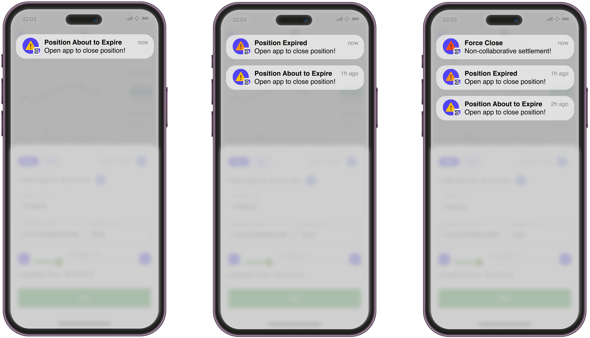

<head>
  <meta name="og:image" content="10101_app_empowerment.png" />
</head>

In a [previous blogpost](./../2023-05-11-10101-trade-settlement.md) we talked about self-custodial settlement paths in 10101.
In this blogpost we explore how the 10101 app will enable you to stay self-sovereign in your self-custodial trade setup.

Without a certain level of self-_sovereignty_, your self-_custodial_ setup might not be as protective as you think.
If you depend on a single service provider too much, then you might not be able to act in a worst case scenario.

<!-- truncate -->

## Self-custodial mobile setup

When using the Lightning network you depend on your Lightning node being online because you have to ensure that the other party has not published a state that is to be punished.
This does not mean that you have to be online all the time, but you have to come online within certain timeframes.

In the spirit of self-custody and self-sovereignty the 10101 app runs a Lightning node on your phone.
Specifically, the 10101 Lightning node is based on the [Lightning Dev Kit (LDK)](https://github.com/lightningdevkit/).
As for any other Lightning node setup, this means that the 10101 app has to come online within certain timeframes to stay safe.

10101 acts as a Lightning Service Provider (LSP) and provides service for you when you use the 10101 app:

- Discovery: Get matched with a trading partner through our orderbook
- Execution: Set up the trade through the 10101 coordinator node (fully self-custodial)
- Notifications: You receive notifications for opening the app when needed

Building a censorship resistant system for the future is part of our vision and is very important to us.
During the beta program our orderbook is run by 10101 as a centralized service for simplicity, but we aim to decentralize the 10101 orderbook.
There are multiple different ways to build a decentralized orderbook, we started exploring how this can best be achieved on top of Nostr as global coordinator layer.

The execution of all trades is always through a Discreet Log Contract (DLC) setup, allowing for a [non-collaborative settlement](../2023-05-11-10101-trade-settlement.md) if necessary.
Due to a non-collaborative settlement being more expensive and time intensive it should only be triggered if it is necessary.
Notifications from 10101 to your 10101 app enable a smooth UX to make sure the necessary steps are made to keep the self-custodial setup as inexpensive as possible.

## Ensuring non-collaborative settlement

If you run a Lightning node, but cannot be online for longer periods of time, there are ways to let a service handle the monitoring for you.
For example a [watchtower](https://bitcoinops.org/en/topics/watchtowers/) can help you monitor for a potential punishment scenario and publish pre-signed transactions for you.

Similarly, you can let a watchtower handle a [non-collaborative settlement](../2023-05-11-10101-trade-settlement.md) because all the transactions involved in a non-collaborative settlement are pre-signed and can be published unilaterally.
However, a non-collaborative settlement is more expensive.
When you go on chain by executing a non-collaborative settlement you have higher fees and you have to wait longer for the funds to arrive in your on-chain wallet.
A watchtower can help you execute transactions in a worst case scenarios without you being online, but ultimately you want to avoid such a scenario unless it is the only way out.

## Avoiding non-collaborative settlement

You can see the 10101 app as your safeguard for helping you manage your self-custodial trades.
The goal is to avoid additional costs - the goal is to avoid a non-collaborative settlement.

In order to _collaboratively_ close or extend a position with your trading partner your 10101 app will have to be online, because you have to sign one or multiple transactions with your trading partner.
Since the setup is self-custodial and the keys never leave your phone the app has to be online for signing.
If you open a perpetual future in 10101, and then you close the app, eventually the app will have to be online again to prolong or close the future.
In case the app does not come online your trading party will eventually have to assume you are not responsive anymore and will have to trigger a non-collaborative settlement.

The 10101 app, and 10101 as Lightning Service Provider (LSP) help you to avoid a non-collaborative settlement.
10101 ensures that you receive push notifications that make it clear when an action is required.
This enables you to get informed and trigger actions to avoid an unnecessary non-collaborative settlement.

These services are convenience features.
If you ignore the notifications it just means that the execution may be more expensive because a non-collaborative settlement will be triggered by the trading counterparty.
While push notifications will be sent out by 10101, it does not have to be 10101 that provides this feature.
To make this setup more resistant against censorship all our code is open source and other service providers could eventually step in and provide these services.
This could be handled similar to a watchtower setup in the Lightning network; watchtower providers could monitor position expiry maturity and notify the user as necessary.

## Automation in a self-sovereign setup

Arguably, it can be difficult to react to notifications on the phone immediately at all times.
You might be busy at your workplace or asleep, not able to react when a notification arrives.

Additionally, it can be hard to monitor the price all the time without automated order creation.
For many traders the ability to create limit orders at a certain price is essential for their trading strategy.
For market makers limit orders, and the ability for an automated trade setup is very important.

During our beta phase we are exploring ways for a more convenient yet self-custodial setup for traders and market makers.

### 10101 in your self-sovereign node setup

One way to achieve self-sovereign automation is plugging the 10101 app into your own node setup.
This could be for example a self-sovereign Lightning node setup on [Umbrel](https://umbrel.com/).
You install the 10101 app on your Umbrel node but configure your trade settings in the 10101 app on your phone.
In this setup you remote-control the 10101 app on Umbrel through the 10101 app on your phone.
A setup on Umbrel will enable additional features such as market making by automated limit order creation.
The 10101 app on your phone then becomes an extension of controlling and monitoring your market making setup on Umbrel.

Such a solution is very much in line with our vision of a self-sovereign individual - it is in the true spirit of Bitcoin.
But, with great power comes great responsibility.
If you run your setup yourself you have to ensure that it is online, available and up to date to ensure that your trades are executed without problems.

### Trustless vs. Convenient: A vision to serve everybody

For some users it is very important to be completely independent and some have the (technical) abilities to set up their own node infrastructure and maintain it.
Others may not have the necessary technical skills to do so, but self-custody is still significant to them, because counterparty risk concerns everybody.

As part of our vision for serving everybody we are exploring how federations could be used to create liquidity pools that enable you to sign transactions during a trade setup even if you are not always online.
Instead of running node infrastructure yourself a federations could run the infrastructure for you.
You could imagine a federation as a liquidity pool, where your funds are guarded by multiple federation members.
This would mean that you would hand over custody to a federation you trust - but instead of having one centralize instance that requires trust you may have multiple, transparent control instances that handle the signing according to your configuration.
We are monitoring the progress on [Fedimint](https://fedimint.org/) to evaluate if federations could be a solution to serve more users eventually.

---

Are you a self-sovereign individual?
Can you see yourself ever trusting a federation with your BTC?

We would love to hear your opinion [on Telegram](https://t.me/get10101) or [Twitter](https://twitter.com/get10101)!

Join our beta program and be one of the first to try self-custodial finance!

<form-widget mode="popup" ucid="fYdNFh2lxfjzyTLHzY9gsiOs7K0" id="i-want-trade-action-bottom"></form-widget>

Happy stacking,   
The 10101 team
