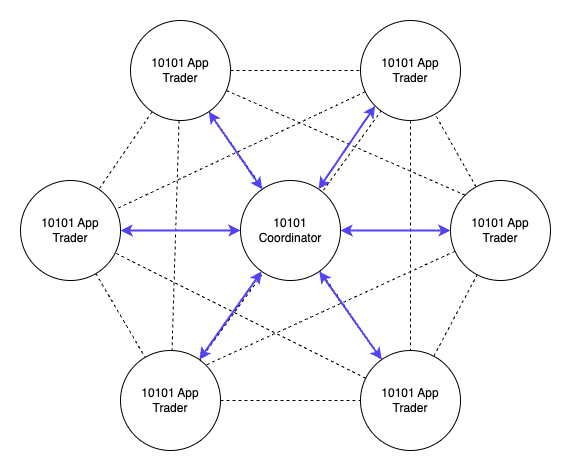

10101 aims to bring self-custodial p2p perpetual futures trading to users without sacrificing UX.
Centralized exchanges are easy as they only have to keep a book updating all events on their own system. But 10101 is distributed.
Every user is running their own trading node through the 10101 app or dlc connect web app.

In order to compete with the simplicity of central exchange 10101 had to address the following challenges which are easy to solve on central exchanges, but harder to solve in a distributed p2p trading solution.

1. **Discovery**: Matching traders on opposite sides of a trade.
1. **Sovereignty**: Traders remain in control to decide when to close their position.
1. **Speed**: A trade needs to be executed almost instantly.
1. **Free Option Problem**: Avoiding the "free option problem" which gives one trader an unfair advantage.

## What is the 10101 coordinator?

The 10101 coordinator is the solution component to address the before mentioned UX challenges when delivering a self-custodial p2p trading solution.

The 10101 coordinator acts as a bridge to connect all 10101 traders with each other, while at the same time providing an 24/7 online service to coordinate trades.

### Discovery

On a central exchange a user is mererly a set of records in a database.
A central system is keeping record of who opened what position at what price and handles the execution centrally.
Clients are merely interfaces to interact with that central system, but the central system is in full control of all components at all time.

At 10101 trades are setup between equal parties.
A trade can only be setup if both nodes agree to the contract (discreet log contract).
The 10101 coordinator simplifies that discovery by being the only node the users have to connect to.
Through the coordinator any 10101 trader can discover another 10101 trader.

### Sovereignty

When submitting an order the coordinator will look for one or several matching counterparties.
Once found the coordinator initiates the dlc protocol with each party.
That means your direct counterparty will always be the 10101 coordinator, but implicitely whoever the coordinator matched you up with.

For executing an order all parties have to be online to exchange the required messages to establish a dlc.
But once this is setup any 10101 Trader can independently control their position, without having to rely on their indirect counterparty to be online.

#### Simple example

1. Alice wants to go $500 long and Bob wants to go $500 short.
   Both submit an order to the coordinator.
1. The coordinator matches Alice with Bob and iniates the dlc protocol.
1. The coordiantor establishes a dlc with Alice acting as the counterparty going $500 short.
1. The coordinator establishes a dlc with Bob acting as the counterparty going $500 long.

Assume Bob wants to close his position.

1. Bob submits a closing order going $500 long.
1. The coordinator will look for a matching order going $500 short.
1. If a match can be found (doesn't have to be Alice) the coordinator executes the same procedure as before with Alice but this time with a new party.
1. If no match can be found.
   The order will remain open until a match has been found.

Two key take aways from that simple example:

- The coordinator provides a service to the traders to trade whenever they want.
  Giving them control over their position without impacting the original counterparty.
- Your position remains open until it either expires, get liquidated or the trader closes the position.
  If your originally matched counterparty decides to close their position, the coordinator will look for a replacement without you even noticing.

### Speed

The bitcoin price moves fast and so must the trade.
In a central exchange a trade is merely a database update.
It can't really get faster than that, but with dlc channels we can get very close to it.

At 10101 your first trade will open a dlc channel.
A multi-sig transaction that locks up your and your counterparties (coordinators) trading balance on-chain.
This first transaction (funding tx) can take some time depending on the fee environment.
But once confirmed any consecutive trade is nearly instant.

The hub and spoke design pattern of 10101 allows to optimize the generation of these dlc channels and thus minimizes the corresponding on-chain costs.
Assume in the diagram provided above, every 10101 Trader would open a direct dlc channel with each other 10101 Trader.
That would result in 30 (n \* n-1 | n=6) channels.
With the 10101 coordinator in the middle we only need 6 (n | n=6) channels.

_Note, its absolutely possible that two 10101 nodes can open a dlc channel with each other and trade independently from the 10101 coordinator.
This makes sense if two trades want to trade bigger volumes and generally only want to go the opposite direction._

#### Capital Efficiency

Another benefit of using a coordinator is the capital efficiency.
Assume you want to trade with 1 Million sats.
If you'd want to be able to trade that volume with any of the other 10101 traders (from the example above) you'd have to lock up 6 Million sats in dlc channels, which would leave you with an inefficient use of your capital.

_Note, this might be optimized by routing dlc contracts similarily to how lightning routes payments._

### Free Option Problem

The free option problem allows a trader to delay or back out of a trade after both users have collateralized it.
He would do so based on whether the exchange rate has moved for or against their favor since the time that the terms were set.

Because DLC protocols are synchronous, one trader must be the first to sign all corresponding transactions.
The second user should do the same afterwards.
This stepwise process gives the second user the unique ability to delay the trade while monitoring the prevailing exchange rate.
If the rate has moved in their favor since the time that the terms were set (prevailing rate is now worse than the agreed-upon rate), then we should expect them to complete the swap.
Conversely, if it has moved against them, it is in their best interest to let the swap expire, take their refund, and begin the process again.

This is called the **Free Option Problem** and has been exploited in the past [^1].

Centralized exchanges do not face this problem because the platform ensures safe execution.

In 10101 - the coordinator connects two traders with each other holding back both signatures until all signatures are available. This way, we solved the free option problem.

## Conclusion

The coordinator is a necessity to mitigate the UX challenges that a self-custodial trading platform has to deal with and offers an easy to use solution to enable traders to take back custody of their funds.

It is comparable to Lightning Service Providers (LSP) and provides liquidity and accessibility to a whole network of nodes.

With the technology and the spec evolving LSPs become more and more of a commodity entering a competitve market within lightning wallets.
The key drivers here are provided liquidity, smoothness of service operation and fees.
Equally we believe that the coordinator will evolve into a similar service provider which will eventually enable a competitve market with the same key drivers.

### Get Involved

- **Try Our Platform:** Experience the future of Bitcoin trading today by downloading the 10101 app. Available for Android and iOS, you can start exploring all our features in the current beta version. Visit [our website](https://10101.finance/)[^website] for direct links to download the app.
- **Follow Us on Social Media:** Join our community on [Twitter](https://twitter.com/get10101)[^twitter] or [Telegram](https://t.me/get10101/1)[^telegram] to stay engaged with our developments and participate in discussions with like-minded individuals.
- **Provide Feedback:** As a beta user, your feedback is invaluable to us. Help us refine and perfect our app by providing your insights and suggestions. Contact us through the Telegram or on Twitter.
- **Spread the Word:** If you believe in what we’re building, share our story and app with your network. Every mention helps us grow our community and improve our offerings.
- **Contribute:** 10101 is open source. Checkout our [Github](https://github.com/get10101/10101)[^github] and contribute by starting discussions, opening issues and/or pull requests.

### Thank You for Your Support

We are grateful to everyone who has joined us so far on this exciting journey.
Your support and participation are what fuel our continuous innovation and dedication.
Together, we are paving the way for a decentralized financial future that aligns with the true ethos of Bitcoin—empowering and liberating.

[^website]: https://10101.finance
[^twitter]: https://twitter.com/get10101
[^telegram]: [https://t.me/get10101](https://t.me/get10101/1)
[^1]: https://medium.com/boltzhq/the-problem-with-free-options-69f9f59a2d48
[^github]: https://github.com/get10101/10101
