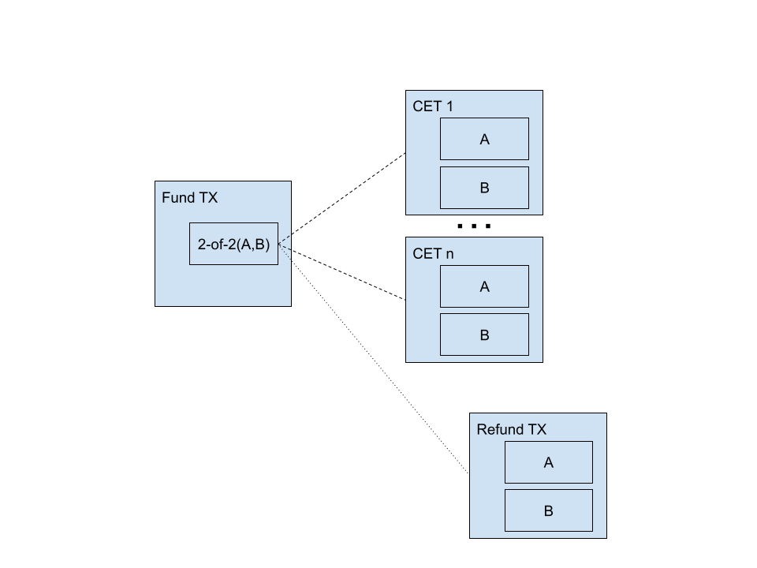
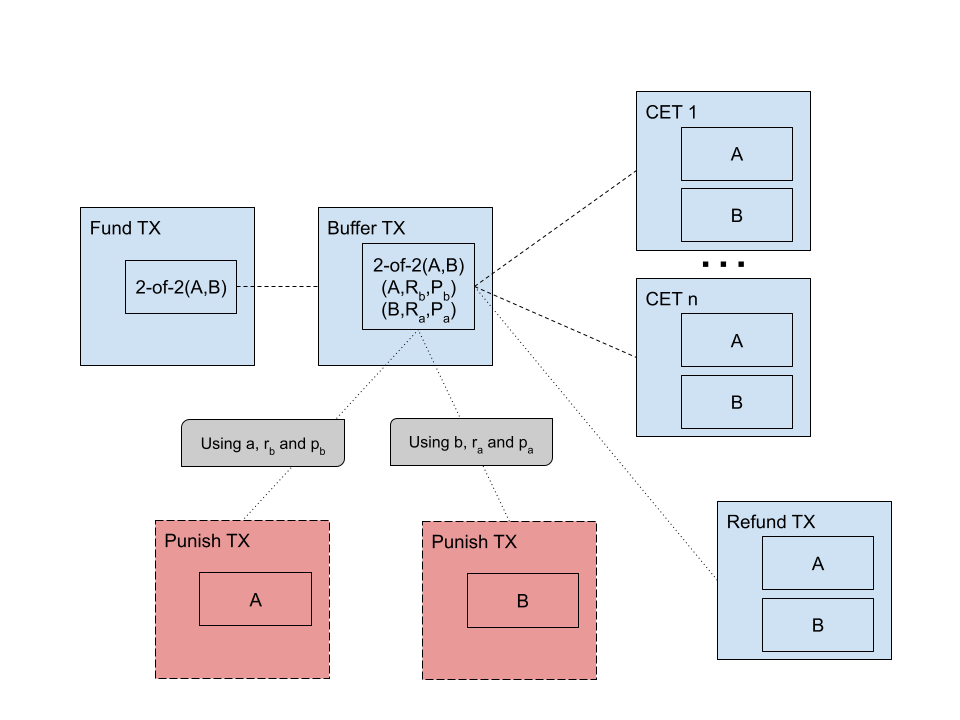
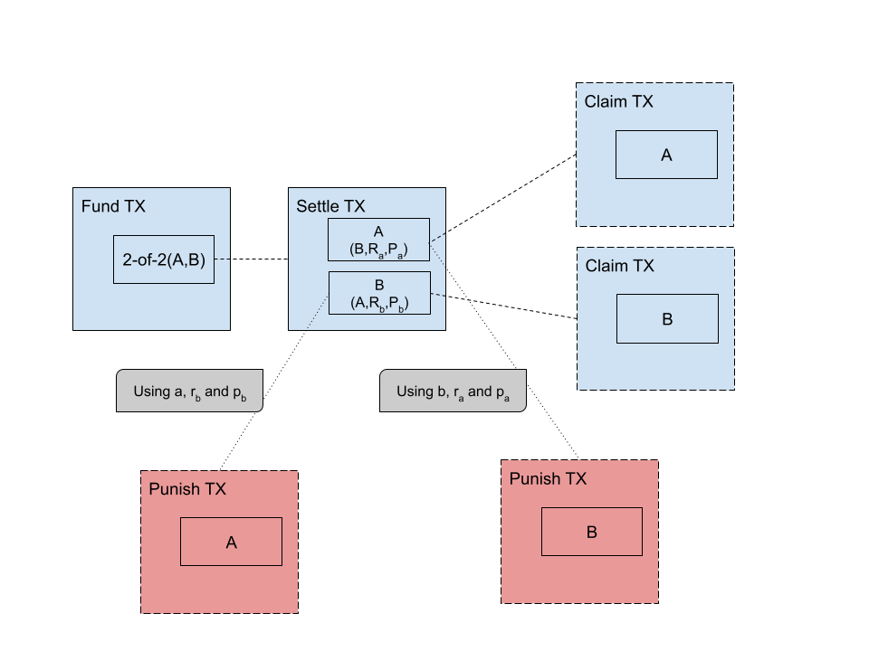

With 10101 you can use your bitcoin to trade self-custodially and without counterparty risk.
This means that you don't have to give us your sats to trade, and that your profit is guaranteed if you make smart decisions.
In contrast, when you trade on a central exchange, you have to put money in someone else's wallet, and you have no assurance that the exchange will fulfil their part of the deal.

Simply put, with 10101 your Bitcoin investments are **secure**.
This is possible thanks to Discreet Log Contract (DLC) channels, the topic of this post.
In the next sections we will explain how 10101 uses DLC channels to enable self-custodial and counterparty-risk free trading on Bitcoin.
We will also touch on the inner workings of the DLC channel protocol.

<!-- truncate -->

To follow this post, you will need to be familiar with the UTXO model.
Additionally, you should be acquainted with perpetual swaps or Contracts For Difference (CFDs)[^1].

## Terminology

A DLC is a Bitcoin 2-of-2 multi-signature transaction output that can be spent in several ways.
Like most 2-of-2 multisigs, the two parties can collaborate to spend the output at any point.
Unlike most 2-of-2 multisigs, the output can also be spent unilaterally based on the conditions of a _financial_ contract.
This financial contract is drawn up before the DLC is published on-chain.
The contract defines all the ways in which the output could be split, and a Contract Execution Transaction (CET) is pre-generated per split.
The CETs are not immediately valid, but a cryptographic protocol enables a trusted third party, the oracle, to render _one_ of them valid at a fixed point in time in the future.
The fixed point in time in the future is known as the DLC expiry.
With a valid CET, either party is able to enforce the conditions of the financial contract and claim their profits (or losses).

_Transactions involved in a vanilla DLC protocol._

A _channel_ is a generic term used to describe a set of _off-chain transactions_[^2] that spend from an on-chain, multi-signature output.
With a channel, we can use coins without paying for transaction fees and without waiting for confirmations.

The quintessential example of a Bitcoin channel is a _Lightning channel_.
With Lightning, two parties can send coins to each other, by creating new off-chain transactions and invalidating old ones.
As such, the current state of a Lightning channel is defined by its latest, valid, off-chain transaction.
The same principle applies to all Bitcoin channels: an update to the channel creates a new set of off-chain transactions, with coins arranged in a particular way, and it revokes the validity of the off-chain transactions of the previous update.

Thus, a DLC channel is a DLC whose state can be updated by creating new off-chain transactions and invalidating old ones.
Whilst a regular DLC is useful by itself, with a DLC channel we can reproduce _perpetual_ financial contracts.
With DLC channels we are also able to minimise on-chain transaction fees and attain near-instant trading for the lifetime of the channel.

## Opening your first position

When you trade with 10101, you are trading BTCUSD perpetual futures[^3].
The first time you open a position with the 10101 app, you are creating a new DLC channel.
Our 10101 coordinator[^4] node is your counterparty in the DLC channel.
You bring in some sats, we bring in some sats, and we lock them up in a 2-of-2 multi-signature output aka the _fund output_.

Before we actually commit the fund output on-chain, we must create all the necessary off-chain transactions and make them spendable based on certain conditions.

The fund output is spent by a _buffer transaction_, with a single transaction output which is also a 2-of-2 multisig.
The _buffer transaction_ is what puts the "channel" in DLC channel.
This will become apparent in a latter section.

The buffer transaction output can be spent in 3 different ways, but let's focus on two of them first.

1.  CETs

    The buffer transaction can be spent by one of several CETs.
    For each CET, each party is able to provide their own signature for the buffer transaction output.
    On the other hand, each party needs to be given the signature of their counterparty to be able to fulfill the 2-of-2 spend condition.

    But we want the CETs to be spendable based on what the price of Bitcoin does, so signatures cannot be exchanged straight up.
    Instead, we share "encrypted" signatures, more commonly known as _adaptor signatures_.
    Adaptor signatures are incomplete signatures that can be completed by combining them with a certain secret.
    And, importantly, they include a proof that they can be completed by that particular secret.

    If we want a CET to only be spendable if the price of Bitcoin is `$X` at expiry time `T`, we construct its adaptor signature in such a way that it can only be unlocked if the oracle attests to price `$X` at time `T`.
    This is possible because the oracle routinely announces the public random nonces[^5] it will use to attest to the price at specific times in the future.

    After exchanging adaptor signatures for each CET, both you and the 10101 coordinator are ready to enforce the contract unilaterally based on the future attestation of the oracle.

2.  Refund

    By involving an oracle, we introduce an element of trust in a third party.
    The oracle proves that it _can_ unlock any of our CETs, but we cannot guarantee that it will do so.
    The oracle could misbehave, or it could simply be offline when we expect it to attest to a price.

    If the oracle fails to meet the expectations, we fall back to an alternative _refund transaction_.
    This refund transaction returns funds to their original owners, as if no financial contract was set up in the first place.

    The refund transaction only exists to ensure that funds are not locked up forever.
    It is only valid after a long timelock has expired.
    In 10101, we use a 7-day long timelock from the time the buffer transaction is included in a block.

    An unreliable oracle which causes DLCs to be refunded should not be trusted.
    This is one of the reasons why it is preferable to use a quorum of oracles when setting up a DLC or a DLC channel[^6].

## Sealing the deal

With the setup out of the way, we just have to sign the fund transaction and put it on-chain.
In 10101, you have to wait for one confirmation before you can do any further trading, but you can see how your position is performing right away.

## More trades

Imagine that you went long with your first position, but the price has tanked a bit.
You might see this as an opportunity to double down.
And so you do: you buy more contracts to go long.
But what is happening under the hood?

When you open your _first_ position, you are given a choice of how much additional trading liquidity you want to bring in beyond the margin that you need to cover your first position.
We refer to this as the _collateral reserve_.
The point of using a channel is that you can keep trading without having to deal with transaction fees or network congestion.
But to enjoy those benefits you need to anticipate how much margin you may want to use in the future[^7].
This is similar to what you would need to do on a central exchange, having to deposit more bitcoin to trade larger amounts[^8].
But with the crucial difference that you **never give up control of your coins with 10101**, because the DLC channel is self-custodial.

Thus, when you resize your position you are moving funds between your collateral reserve and your position margin.
In the example above, to buy more contracts you would have to _reduce_ your collateral reserve to _increase_ your position margin.
The same would happen to the 10101 coordinator, who also has to bring in a collateral reserve in the first place[^9].

This movement of funds between different "buckets" will be encoded in a new set of CETs.
The new set of CETs is generated in the same way that we explained above.
But to commit to the new CETs, we must invalidate the original set of CETs.
This is where the buffer transaction comes into play, because the buffer transaction output can actually be spent in more than one way:

1.  By providing a signature from each party, like in a regular 2-of-2 multisig.
2.  By providing a counterparty _publish secret_ and a counterparty _revocation secret_.

The first path corresponds to using a CET, as described previously.
The second path is what makes buffer transactions revocable.

_Transactions involved in a DLC channel protocol with an open position._

Revocation secrets are exchanged during the last step of updating the state of the DLC channel, for example when increasing the size of our 10101 long position.
And the counterparty publish secret is revealed if the counterparty publishes a buffer transaction.

This means that if our counterparty publishes a buffer transaction, and we know the corresponding revocation secret, we can just claim all the funds from the buffer transaction output.

A transaction which uses the counterparty publish and revocation secrets is known as a _punish transaction_.
It is the third and final way in which a buffer transaction can be spent.

## Closing your position

A few hours pass and you are in the plus!
You are now ready to realise your profit, so you close your position.
This process is actually much faster and quite simple, and you can feel it when using the 10101 app.

We still have to revoke the previous state of the DLC channel, but instead of generating a bunch of new CETs, we create a _settle transaction_.
The settle transaction spends from the fund transaction output, and it has one output per party.
Each output corresponds to how much each party gets after all the trading has been settled.

_Transactions involved in a DLC channel after settling a position._

Once again, the settle transaction remains off-chain, because we want to be able to keep trading without paying transaction fees.
If you now wanted to open a new position, you would replace the settle transaction with a new buffer transaction, invalidating the settle transaction in the process.

## Closing your channel

Once you are done trading with your current DLC channel, you can collaborate with the 10101 coordinator to close it.
Before closing the channel collaboratively, you need to close your position.
With a closed position we know how much each party should get back, so we are able to construct a _collaborative close transaction_.
The collaborative close transaction spends from the fund output, and it pays directly to the user's and the coordinator's on-chain wallet.

The collaborative close transaction is meant to go on-chain right away.
Once confirmed, all the off-chain state of the DLC channel can be disregarded, because the fund output is no longer spendable.

Collaboratively closing your DLC channel is the best possible outcome when closing, because it's fast and cheap.
But it requires cooperation, and you can't always guarantee that your counterparty will oblige.
The 10101 coordinator is designed to be online, responsive and to always play by the rules, but so too are central exchanges.
What sets 10101 apart is your ability to cash out without the coordinator's permission.

## Force-closing your DLC channel

Trying to withdraw, but the coordinator is down?
Time to force-close[^10].

Force-closing is just about using some of the transactions that we described earlier.

1.  With an open position

    If you have an open position, force-closing will involve publishing a buffer transaction and a CET.
    The buffer transaction can be published at any point, but it must not already be revoked.
    Publishing a revoked buffer transaction should result in loss of funds.

    After the buffer transaction has been published, you need to wait for 288 confirmations to publish a valid CET.
    This timelock is meant to give the counterparty enough time to punish in case the buffer transaction used had already been revoked.

    After 288 confirmations on the buffer transaction, we may still need to wait for the oracle to make one of the CETs valid.
    Each CET was created so that it would be unlocked if the oracle attested to price `$X` at expiry time `T`.
    At time `T`, the oracle should attest to a price `$Y`.
    For the CET corresponding to this price `$Y`, the counterparty adaptor signature can be "decrypted", converting it into a full counterparty signature.
    With the counterparty signature, the CET is valid and can be published.

    If the oracle does not come through with any attestation, 7 days after the inclusion of the buffer transaction in a block, the refund transaction can be used to recover the funds.

2.  With a closed position

    If you have a closed position, force-closing will involve publishing a settle transaction.
    The settle transaction can be published at any point, but it must not already be revoked.
    Publishing a revoked settle transaction should result in loss of funds.

    After the settle transaction has been published, you need to wait for 288 confirmations to claim your funds.
    This timelock is meant to give the counterparty enough time to punish in case the settle transaction used had already been revoked.

    After 288 confirmations on the settle transaction, you will have to publish a _claim transaction_ to move your funds into your on-chain wallet.
    A claim transaction is just needed to move your funds from a transient `P2WSH` output to an on-chain wallet address.
    There is no time pressure to do this though.
    You may wait for this to happen when transaction fees are favourable[^11].

3.  Consequences of force-closing a DLC channel

    It is better to collaboratively close a DLC channel than to force-close it because everything runs smoother.
    You get your funds back after one confirmation, and you only have to pay transaction fees for a single transaction.

    Conversely, when force-closing you will have to wait at least 2 days, and often much longer if the CET expires later than that.
    Additionally, when force-closing with an open position, you only get the price that the oracle attests to at expiry time.
    This is not necessarily the same price that you would get if you closed the channel _collaboratively_ when you executed the force-closure.

    This is to say that it's usually preferable to wait to force-close until it appears to be the only path forward.

4.  Dealing with oracle collusion

    All DLC protocols place trust in the oracle.
    We already touched on the refund transaction as a fallback mechanism in case the oracle does not act.
    But we should also consider the possibility that the oracle attests to an incorrect value.

    If an oracle were to purposefully (or by mistake!) attest to an incorrect value, benefiting one of the two parties, there would be no recourse.
    At that point, the aggrieved party would be able to demonstrate the oracle's misbehaviour and encourage other users to stop trusting the oracle, but the coins would already be lost.

    To mitigate this problem, we will replace the oracle, a single point of failure, with a quorum of oracles.
    A sufficiently large quorum of oracles, for example 3-of-5 or 5-of-9, would make collusion much less likely.
    Using multiple oracles does come at the cost of complexity and speed, as CET adaptor signatures become more expensive to generate.

## Future improvements

Our beta test run has shown that DLC channels can be used to provide self-custodial and counterparty-risk free trading to 10101 users.
But the user experience is not flawless.
We have several ideas in store to improve it:

1.  All DLC protocol transactions must be fee-bumpable

    To fee-bump a transaction is to give it a push, by providing more fees with another transaction.
    Using the Child Pays For Parent (CPFP) technique, we can already bump the funding transaction, the punish transaction, the refund transaction and the CETs.
    But the buffer transaction and the settle transaction do not contain outputs that can be fee-bumped.

    The solution is to add anchor outputs to the buffer and settle transactions.
    An anchor output is a transaction output that is only added for the purpose of fee-bumping.
    It is as small as possible, as the child transaction spending from it will bring all the fees needed to bump the original transaction.

    This feature is important because it is impossible to anticipate what the fee environment will be when we want to force-close the DLC channel, at the time of opening the DLC channel.
    A fee reserve is included in the DLC channel, but it's not a reliable solution.

2.  Users must be able to splice in and out of DLC channels

    _Splicing in_ is a term used to describe the process of adding funds to a channel by way of a single on-chain transaction.
    Like depositing into your trading account.
    _Splicing out_ is used to describe a similar process, where funds are extracted from a channel.
    Like withdrawing from your trading account.

    These processes can be applied to DLC channels too.
    Splicing in and out is valuable because it reduces the number of transactions needed to resize a DLC channel.

    10101 users commonly ask to add funds to their DLC channel.
    At the moment we tell them to close their DLC channel and open a bigger one.
    Splicing in would let them do so in a single, cheaper step.

    Furthermore, with splice-in we could allow winning traders to request the _coordinator_ to bring in more liquidity so that they can keep trading.

3.  Speeding up the DLC protocol

    The 10101 app noticeably slows down when you open a channel, open a new position or resize an existing position.
    Some of this is inherent to using DLC channels: a lot of signatures and adaptor signatures need to be generated, exchanged and verified.
    But we are always looking for ways to make this process faster.

    The primary maintainer of the [DLC library](https://github.com/p2pderivatives/rust-dlc) we use and co-maintain, recently came to us with promising benchmarks after replacing ECDSA adaptor signatures with Schnorr adaptor signatures in the on-chain DLC protocol.
    We expect that by applying the same changes to the DLC channel protocol we will be able to speed up trading in 10101 considerably.

## Closing thoughts

We have discussed how 10101 uses DLC channels to provide self-custodial and counterparty-risk free trading.
From opening your first position and DLC channel, to closing your DLC channel with the collaboration of the 10101 coordinator, or with the unbeknownst help of the oracle.

Throughout, we have highlighted the ways in which DLC channels offer a more secure alternative to central exchanges.
We have also been clear about where problems might arise, and how a full-fledged 10101 will deal with those limitations.

If you have any questions on this or any other topics, do not hesitate to reach us on [Twitter](https://twitter.com/get10101) or [Telegram](https://t.me/get10101/1).

# Footnotes

[^1]: Simply put, a perpetual swap or CFD is a contract where one party (the long party) gets paid if the price of a security goes up, and their counterparty (the short party) gets paid if the price of that security goes down.
[^2]:
    An off-chain transaction is a transaction that hasn't been published yet.
    An off-chain transaction may never be published, as it may be invalidated and replaced by another one.

[^3]: We are not limited to BTCUSD or perpetual futures, but we are focusing on this at the moment.
[^4]: To learn more about the 10101 coordinator, you can read [another post of ours](https://10101.finance/blog/what-is-the-10101-coordinator).
[^5]:
    A nonce is a large, secret number that must be used only once in cryptographic schemes.
    The oracle cannot reveal the nonces it uses to attest to the prices, because that would leak its secret signing key.
    But it _can_ reveal the public key corresponding to each nonce.

[^6]:
    In 10101, we currently use a single oracle that we run ourselves.
    This is acceptable for a beta product, but we will be using at least one independent oracle before we end the beta phase.

[^7]:
    It is always possible to close your current DLC channel and open a bigger one if you want to trade larger amounts.
    In the future, we will also support splicing in, so that adding trading liquidity to your DLC channel is as cheap as possible.

[^8]:
    There is an obvious parallel between trading accounts in centralised exchanges and DLC channels in 10101.
    To avoid on-chain fees when sending funds back and forth, users tend to make larger deposits to cover their future margin needs.

[^9]:
    When you open your first position, you can control how much liquidity the 10101 coordinator will bring into the DLC channel.
    The coordinator's liquidity caps the profits that you can realise through trading with that DLC channel.
    When 10101 is out of beta, standing trading liquidity will not come for free, as the coordinator will need to use its capital efficiently.

[^10]:
    You cannot currently force-close using the 10101 app.
    We chose to limit this until we were more confident in our implementation, to prevent loss of funds.
    Having tested it extensively over the past few months, we are ready to include it in one of the next releases of the app.

[^11]:
    At the moment, the 10101 app will eagerly claim settle transaction outputs.
    This is done for simplicity, as it's easier to manage `P2WPKH` UTXOs.
    Eventually, we will work on managing settle transaction outputs more efficiently.
