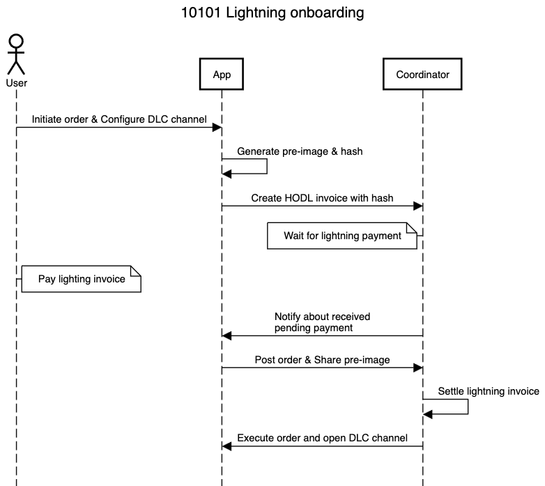

End of January we dropped lightning support to address some overly complex parts of our solution. You can read up more about out reasons [here](https://10101.finance/blog/see-you-later-mr-lightning). This transition allowed us to focus on improving user experience and trading features, resulting in a more stable and user-friendly platform. However, we always intended to bring back Lightning.

## Lightning strikes twice

We are pleased to announce the return of Lightning integration in 10101. **In this first step we enable users to fund a 10101 0-conf dlc channel using Lightning**. Allowing the users to use 10101 within seconds, without having to wait for any on-chain transaction.

Let's look into some details on how this has been implemented within 10101.

1. **Order Initiation and Channel Configuration**:

   - The user opens an order. If no DLC channel exists, the user is prompted to configure their DLC channel capacity, ensuring a streamlined setup process.

2. **Funding the Position**:

   - After configuring the DLC channel, the user opts to fund this position using Lightning.
   - The app generates a pre-image and shares the hash with the coordinator, who creates a HODL invoice.

3. **Payment Process**:

   - The user pays the Lightning invoice, leveraging Lightning's speed and cost efficiency.
   - Upon receiving the payment, the coordinator notifies the app that the funds have arrived, indicating readiness to execute the order.

4. **Order Execution and Settlement**:
   - The app posts the order and shares the pre-image to settle the invoice.
   - If the pre-image is correct, the coordinator opens the DLC channel, covering all on-chain fees, and executes the order.

The user has 5 minutes to pay the invoice. During this time, they can also put the app into the background and reopen it to complete the trade, ensuring a smooth and flexible experience.

### Benefits

The reintroduction of Lightning for funding your dlc channel brings several key benefits that enhance the overall user experience and platform performance. Here are some of the main advantages:

1. **Speed and Efficiency**:

   - Lightning enables faster transactions, allowing users to fund their positions quickly and start trading without delays.
   - We create the DLC channel in 0-conf (zero confirmation), similar to the LSP flow, allowing users to instantly use their DLC channel for trading without having to wait for an on-chain confirmation.

2. **Enhanced Security**:

   - By generating a pre-image and using a hash to create HODL invoices, we ensure that only verified payments are processed.
   - With HODL invoices, we ensure that a payment is only accepted when we actually executing an order.

3. **Simplified Onboarding**:

   - The streamlined process for configuring DLC channels and funding positions with Lightning makes it easier for users to get started.
   - Users can set up and fund their positions in just a few steps, improving the overall onboarding experience.

4. **Lower Fees**:
   - Lightning transactions generally incur lower fees compared to on-chain transactions, making trading more cost-effective for users.

## Future Plans and Roadmap

As we continue to innovate and improve the 10101 platform, we have several exciting developments on the horizon:

1. **Mitigating Counterparty Risk**:

   - Address the counterparty risk associated with lightning onboarding flow. At the moment a user will have to trust the 10101 coordinator to open the dlc channel when the pre-image is shared.
   - We are exploring the addition of HTLCs (Hashed Timelock Contracts) to the buffer transaction to ensure a trustless onboarding process.

2. **Enhanced User Experience**:

   - Continuous improvements to the app's UI/UX are underway, ensuring a seamless and intuitive user experience.
   - We are also working on separating the creation of a DLC channel from opening your first trade. This will streamline the process and allow users to set up their channels independently of their trading activities.

3. **Lightning Payments with DLC Channels**:

   - We are working on enabling the ability to send and receive Lightning payments using your DLC channel, further enhancing the functionality and flexibility of the 10101 platform.

4. **Evaluating Bridging to Other L2 Networks**:
   - We are actively exploring the potential of bridging to other Layer 2 networks such as Fedimint or Cashu. This will enhance the interoperability of the 10101 platform.

We are excited about these future developments and look forward to sharing more updates with you as we continue to enhance the 10101 platform.

## Get Involved

- **Try Our Platform:** Experience the future of Bitcoin trading today by downloading the 10101 app. Available for Android and iOS, you can start exploring all our features in the current beta version. Visit [our website](https://10101.finance/)[^website] for direct links to download the app.
- **Follow Us on Social Media:** Join our community on [Twitter](https://twitter.com/get10101)[^twitter] or [Telegram](https://t.me/get10101/1)[^telegram] to stay engaged with our developments and participate in discussions with like-minded individuals.
- **Provide Feedback:** As a beta user, your feedback is invaluable to us. Help us refine and perfect our app by providing your insights and suggestions. Contact us through the Telegram or on Twitter.
- **Spread the Word:** If you believe in what we’re building, share our story and app with your network. Every mention helps us grow our community and improve our offerings.
- **Contribute:** 10101 is open source. Checkout our [Github](https://github.com/get10101/10101)[^github] and contribute by starting discussions, opening issues and/or pull requests.

### Thank You for Your Support

We are grateful to everyone who has joined us so far on this exciting journey.
Your support and participation are what fuel our continuous innovation and dedication.
Together, we are paving the way for a decentralized financial future that aligns with the true ethos of Bitcoin—empowering and liberating.

[^website]: https://10101.finance
[^twitter]: https://twitter.com/get10101
[^telegram]: [https://t.me/get10101](https://t.me/get10101/1)
[^github]: https://github.com/get10101/10101
